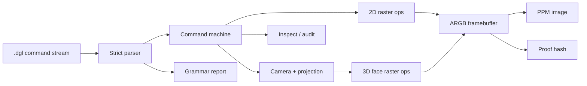

# DEADGL

```text
DEADGL
CPU FRAMEBUFFER COMMAND MACHINE
INPUT:  .dgl command stream
OUTPUT: pixels + proof hash
GPU:    none
```

DEADGL is a C99 command-machine renderer. It parses plain text `.dgl`, mutates an ARGB framebuffer in CPU memory, writes PPM images, and emits deterministic proof hashes.

OpenGL and Vulkan talk to GPUs. DEADGL talks to memory.

## Architecture pipeline



A command changes memory. The final image is bytes. The proof is the hash.

## Build

```sh
make clean test
make
```

## Use

```sh
./build/deadgl --version
./build/deadgl grammar
./build/deadgl demo cube -o cube.ppm
./build/deadgl run examples/command_machine.dgl -o command_machine.ppm
./build/deadgl prove examples/command_machine.dgl -o command_machine.ppm -p command_machine.proof
./build/deadgl hash examples/command_machine.dgl
./build/deadgl inspect examples/near_clip.dgl
./build/deadgl audit examples/command_machine.dgl
```

## Suite tools

```text
deadgl          render / prove / hash / inspect / audit / shell / pack / scenepack / suite / grammar
deadgl-inspect  standalone scene inspection
deadpad         plain-text scene editor seed
deadview        native PPM viewer seed
```

## DGL language

Read `docs/DGL_LANGUAGE.md` or run:

```sh
./build/deadgl grammar
```

## Machine surface

- C99, no dependency
- ARGB framebuffer + depth buffer
- lines, rectangles, circles, triangles
- projected 3D faces
- explicit camera command
- strict `.dgl` parser + grammar report
- DGB bytecode envelope
- DGP scene-pack envelope
- shell command stream
- deterministic hash + plain proof file
- local one-command release cutter

## Refuses

- no GPU wrapper
- no engine layer
- no scene graph
- no hidden render state
- no OBJ-first path

## Release

```sh
sh scripts/release.sh
```

A release is real only if the cutter builds, tests, renders, hashes, packages proof artifacts, and exits cleanly.
